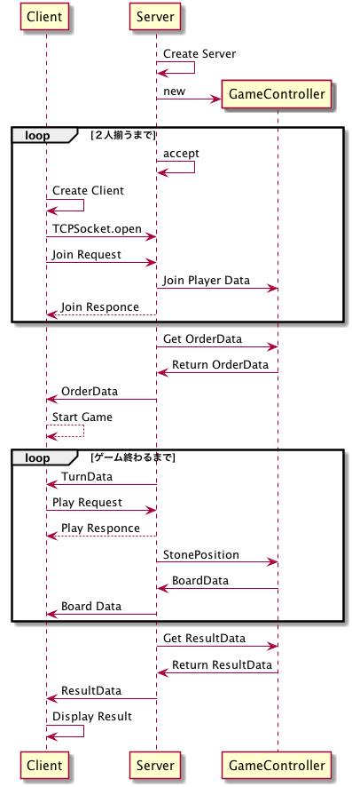

# netopro

## 超雑なイメージ

## 雑な説明
- Serverがプレイヤー参加受付開始
- Clientが参加リクエスト送る(といってもユーザー名のjson)
- Serverは受取、GameController(以下GC)にプレイヤー登録を依頼
- GCはプレイヤーリストにプレイヤー追加。Serverに追加成功可否を送る
- Serverは追加成功可否をClientへ送り返す
- 参加したClientは開始通知が来るまで待機
- Serverは人数が揃ったら、ゲーム開始通知依頼をGCへ行う
- GCはゲーム開始を行い、各プレイヤーの色と手番を送る
- Serverはそれを各Clientへ送る
- 受け取ったClientはそれを表示

ゲーム開始
- [Server]ゲームが終了しているか確認
- [Server]1手番目のプレイヤーを取り出す
- [Server]現在のターン数を表示
- [Server]各Clientにターン数、手番かを送る
- [Client]手番の場合、置くマスを入力させる
- [Client]裏返す石が一つ以上あるならその場所をServerに送る
- [Server]プレイヤーの行動を受け取る
    - 置く場所: 盤面に反映させて石をひっくり返す
    - パス : スキップ
    - リタイア : ゲーム終了
- [Server]現在の盤面情報を取得する
- [Server]各Clientに盤面情報を送る
- [Client]受け取った盤面情報をClientにも反映させ、表示する
- [Server]ターン数をインクリメント

以下ループ

## 雑なクラス図
![image](https://www.plantuml.com/plantuml/png/lLLHJnD147w_Nx7fKp4jYQ_tW6119M90a2TZBckxFLQkTytk5gt6XEw1AKAYCH4JH0NY2yPemCI4HCEFMQx8lt3lRkzk3uheYqsJtinEP-URxvkvOSeWOQs60t03siWmgWwa51Gg3aOkAm18GVm8dXWW-ZGzmanmfp8rWyW28ighVh2B6OOEVeoA0yfLTJoQMHIvjMA3sebDK1NXXUpyWOVTrF1SouODP4KrIkzJ8xuJb1rKPsLLcU5w3CbOu61tNltpP77Zw71Ry5U_jjT4vzd9-ixH8JVatI0CJb5EER2Do2XaC4AQcIdQ5aN4bJMOW3A2NJi1vJaUCILS9ejI3IgNXq3XSa7FOe9cP5WrQSLrXfMh989_5Vwku1y5tn7-D-5tHUTBSkQ_4VxdyCoNtnyzVpdOsfDuUYjx4a-A19mYxAe7IKrZBR9JC7MCd9e9HWY1RIDXZ5fLw5hD5Yi-Ae5sAOOMzbh3aK3JavgIsT2oxeVcFuBRb9Y4lt8nh9Zm297Y_l_eK5Q1Ozr54Yoo5d5BYirSJ8JUmcxTArAlEezO2MGkJSYHi9C8kwgTX4bp9wdC1mU7m7LvUyLp6V4SHwBietN1zwDkRXq__zvRNXMTJwApgyw2roz4PobusHLSFhmLVFMyKSZV4pKyxqeR7xOYbdusifQ36vZftlE98CZ6bCcXYBjPJ4Pi85Dabl9AnbX6XXPPbnVGELIB3hBWXmGpf7EJqtOSOoEcHsYCX0ZJfPFtXh896JehTqM2LBdY8L6rMEHzWeBkkzxcXs1jNN0UBod1k_r2_VU27mX-ACtZZIN9Rl3p85ZPrsRb54_9i2PZ6izdlw1BoR9A5nMzUozLHBPBybkaCZanEMs26v3EAS-ryR69qPpdriZqpPnZvlRioFJOZAwGt3QwM3GKPMmq2MAiRJNbHcPvEYIISxTBVkjh6p-5XcKzixFZetzU_l6idjqzsalXhsSWpdNM7-Ng0-sFRmLZM8f2lij_0m00 "image")

## 参加する
#### Parameters
`Client.join`

| Name    | Type | Description     |
|----------|-----|--------|
| `username` | `string` | プレイヤー名 |

#### Response
`Server.on_join`

| Name   | Type | Description      |
|---------|-----|---------|
| `status`  | `int`  | 通信成否    |
| `message` | `string` | 参加成功可否文 |

## 打つ
#### Parameters
`Client.play`

| Name    | Type | Description     |
|----------|-----|--------|
| `input_type` | `int` | プレイヤーの行動 |
| `x` | `int` | 置いたx座標 |
| `y` | `int` | 置いたy座標 |
| `color` | `int` | 置いた石の色 |

#### Response
`Server.on_play`

| Name   | Type | Description      |
|---------|-----|---------|
| `status`  | `int`  | 通信成否    |
| `message` | `string` | 参加成功可否文 |

## ゲーム開始通知
#### Parameters
`Server.noti_start_game`

| Name        | Type      | Description                   |
|--------------|----------|----------------------|
| `turn_order` | `string` | 手番 (first or second) |
| `id`         | `string` | プレイヤーid              |
| `username`   | `string` | プレイヤー名               |
| `color`      | `int`    | 色 (-1 or 1)          |

#### Response
`Client.on_noti_start_game`

| Name | Type | Description  |
|-------|-----|-----|
|       |     |     |

## 手番通知
#### Parameters
`Server.noti_play_turn`

| Name          | Type      | Description     |
|----------------|----------|--------|
| `turn_count`   | `string` | ターン数   |
| `is_play_turn` | `bool`   | 手番かどうか |
| `is_finish_game` | `bool`   | ゲームが終了したかどうか |

#### Response
`Client.on_noti_play_turn`

| Name | Type | Description  |
|-------|-----|-----|
|       |     |     |

## ボード情報の通知
#### Parameters
`Server.noti_board_info`

| Name          | Type      | Description     |
|----------------|----------|--------|
| `board_info`   | `list` | ボード情報   |
| `username` | `string`   | 行動したプレイヤー名 |
| `input_type` | `int`   | プレイヤーの行動 |
| `x` | `int`   | 置いたx座標 |
| `y` | `int`   | 置いたy座標 |

#### Response
`Client.on_noti_board_info`

| Name | Type | Description  |
|-------|-----|-----|
|       |     |     |